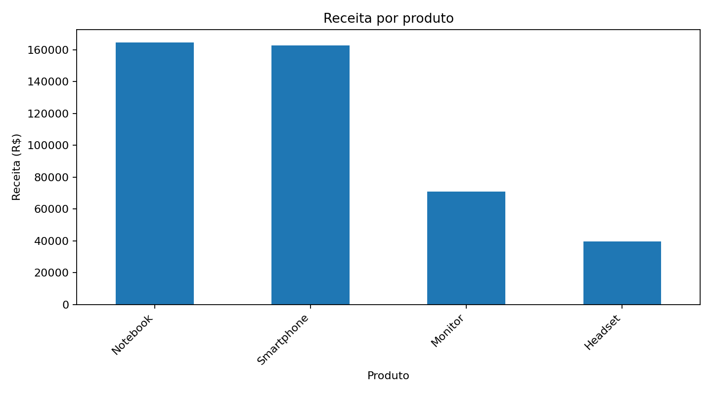
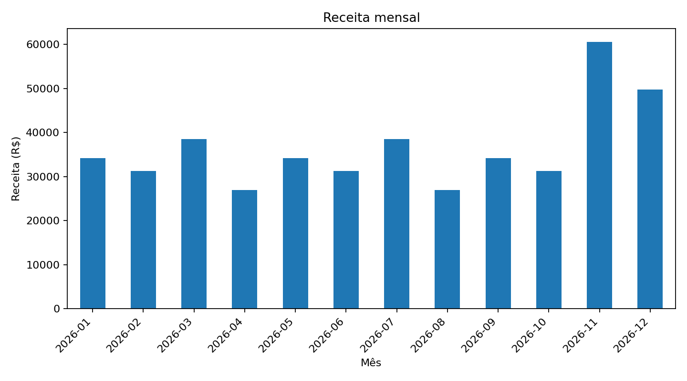
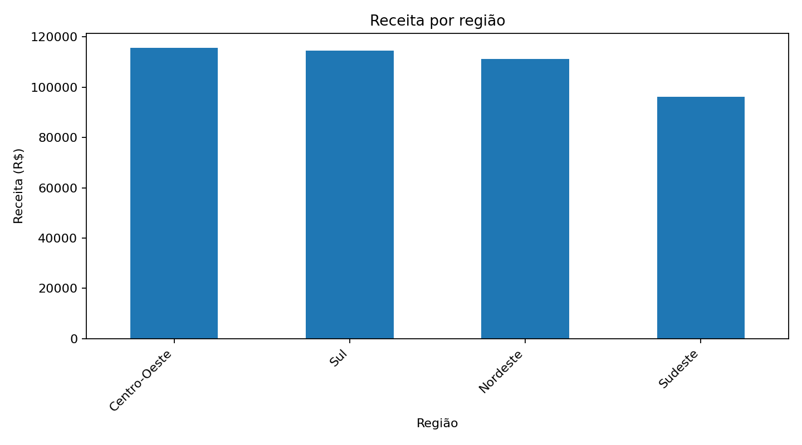
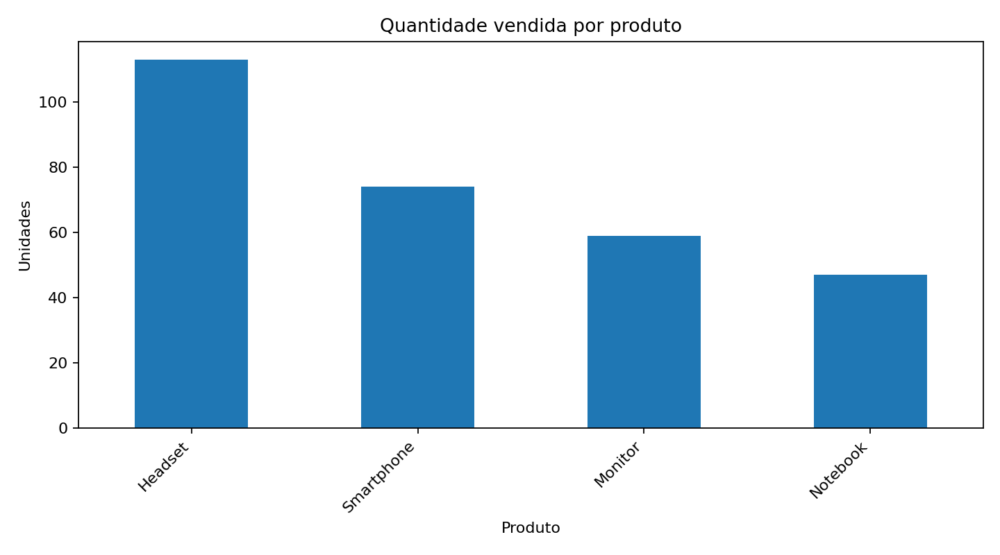

# 📈 Sales Insights — Análise de Vendas

Projeto de análise de dados com foco em transformar dados fictícios de vendas em informações úteis para tomada de decisão.

A proposta combina conhecimentos de **Administração** e **Tecnologia**, utilizando Python para tratamento, análise e visualização de dados.

## 🎯 Objetivo

Demonstrar como dados de vendas podem ajudar a responder perguntas como:

- Quais produtos geram mais receita?
- Quais regiões apresentam melhor desempenho?
- Quais meses concentram maior faturamento?
- Quais produtos possuem maior volume de vendas?

## 🛠️ Tecnologias

- Python
- Pandas
- Matplotlib
- Git
- GitHub

## 📁 Estrutura

```text
Sales-Insights/
├── dados/
│   └── vendas.csv
├── analise_vendas.py
├── requirements.txt
└── README.md
```

A pasta `graficos/` é criada automaticamente ao executar a análise.

## ▶️ Como executar

Instale as dependências:

```bash
pip install -r requirements.txt
```

Execute:

```bash
python analise_vendas.py
```

O programa exibe um resumo no terminal e gera gráficos em PNG dentro da pasta `graficos/`.

## 📊 Visualizações

### Receita por produto



### Receita mensal



### Receita por região



### Quantidade vendida por produto



## 📊 Resultados do conjunto de dados

Com os dados fictícios incluídos no projeto:

- **Receita total:** R$ 437.650,00
- **Produto com maior receita:** Notebook — R$ 164.500,00 (**37,6%** do total)
- **Região com maior receita:** Centro-Oeste — R$ 115.700,00
- **Mês com maior receita:** novembro de 2026 — R$ 60.600,00

## 📚 Aprendizados

Neste projeto são praticados conceitos como:

- Leitura e tratamento de dados com Pandas
- Criação de métricas de negócio
- Agrupamento e consolidação de informações
- Análise de receita por produto, região e período
- Criação de visualizações com Matplotlib
- Organização de um projeto de análise de dados para portfólio

## ℹ️ Observação

Os dados utilizados são **fictícios** e foram criados exclusivamente para fins de estudo e demonstração.

## 👨‍💻 Autor

**Guilherme Augusto Morais**

- GitHub: https://github.com/Guilherme-code10
- LinkedIn: https://www.linkedin.com/in/guilherme-augusto-morais/
